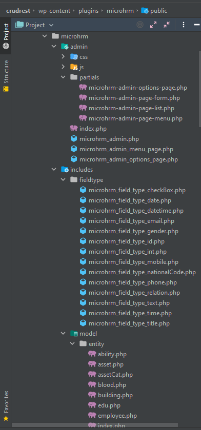

# WPCrudRest : A WordPress plugin creator (plugin code generator) tool
### A Powerful Wordpress CRUD & RESTful plugin Generator framework
## Introduction
This tool is the result of a master's thesis in [MDSE research group at Isfahan University](https://mdse.ui.ac.ir) and contains a set of Eclipse plugins that enable you to generate a WordPress plugin by graphical modelling. We use a Model-Driven approach to generate codes from the model.     
WPCrudRest framework is currently only available as a plugin for Eclipse. It used [Sirius](https://www.eclipse.org/sirius/) to provide a graphical modelling environment and [Acceleo](https://www.eclipse.org/acceleo/download.html) to transform models to code.
## Please participate in the evaluation
You can participate in the evaluation of the WPCrudRest framework through the following links:
* **[Evaluation participate (English language)](https://github.com/asadidebuger/wpcrudrest-docs/blob/main/_posts/2022-08-20-evaluation-en.markdown)**

&#x202b;
* **[مشارکت در ارزیابی (فارسی)](https://github.com/asadidebuger/wpcrudrest-docs/blob/main/_posts/2022-08-20-evaluation-fa.markdown)**

_WPCrudRest Framework and created WordPress plugin demo:_

### *Tested on [Eclipse Modeling Tools 2022-06](https://www.eclipse.org/downloads/packages/release/2022-06/r/eclipse-modeling-tools)  & [windows 10 64X OS](https://www.microsoft.com/en-us/software-download/windows10)  with  [Java 11](https://www.oracle.com/java/technologies/javase/jdk11-archive-downloads.html)*

## Guidance Videos
1. Download Eclipse modeling tools and Install (extract) it -> Watch video in: [Youtube](https://youtu.be/FsehvXbDuf8) - [Aparat](https://www.aparat.com/v/pci6K)
2. Download and deploy WPCrudRest as Eclipse plugin -> Watch video in: [Youtube](https://youtu.be/xeCBqQRdBIg) - [Aparat](https://www.aparat.com/v/KICrQ)
3. Install Acceleo as Eclipse plugin -> [Youtube](https://youtu.be/kwBskje3lfk) - [Aparat](https://www.aparat.com/v/Uh1zM)
4. Start modeling (Create new modeling project) -> [Youtube](https://youtu.be/F5uPJMvkYNI) - [Aparat](https://www.aparat.com/v/1uQBW)
5. Model a simple library manager plugin (example) -> [Youtube](https://youtu.be/8z_OJiiTTws) - [Aparat](https://www.aparat.com/v/j4Bqp)
6. Deploy WordPress (on Windows OS) - Install XAMPP -> [Youtube](https://youtu.be/EqW5lSWWsP0) - [Aparat](https://www.aparat.com/v/1owaH)
7. Deploy WordPress (on Windows OS) - Deploy (Install) WordPress -> [Youtube](https://youtu.be/NnFDoHHKAEE) - [Aparat](https://www.aparat.com/v/mY6i8)
8. Generate and deploy WordPress plugin -> [Youtube](https://youtu.be/uAj5vbeoikU) - [Aparat](https://www.aparat.com/v/W7yP9)

### You can also access full list of tutorial videos by visiting one of the below links:
- [Youtube play-list](https://www.youtube.com/playlist?list=PL8kI35qv4aXaRaETVfC0CgzlgtKy6e6Gk)
- [Aparat play-list](https://www.aparat.com/v/pci6K?playlist=1773307)

## Installation and use instructions:

### You can follow the steps below to deploy and use the framework:

_Note: You can follow [**this link**](https://www.cloudways.com/blog/install-wordpress-locally/) to **deploy WordPress on your personal computer** if you are unfamiliar with WordPress!_

### A. Install Eclipse
1. Download [Eclipse Modeling Tools ](https://www.eclipse.org/downloads/packages/release/2022-06/r/eclipse-modeling-tools)
2. Install (unzip) downloaded Eclipse package

### B. Configure Eclipse and Install required plugins

1. Download latest [WPCrudRest package](https://github.com/asadidebuger/WPCrudRest/releases/latest)
2. Unzip downloaded package and copy [dropins](https://github.com/asadidebuger/WPCrudRest/tree/main/dropins "dropins") directory to eclipse installation path (e.g  C:\Program Files\eclipse)
3. Execute Eclipse
4. Install [Acceleo](https://www.eclipse.org/acceleo/download.html) plugin
5. Install [Sirius](https://www.eclipse.org/sirius/)  plugin if it is not installed *(preinstall in newer versions)*
6. Restart Eclipse

### C. Create a new Modeling Project
1. Click on "File" menu item
2. Choose "New" ->" Other" item from "File" menu
3. In "Select a wizard" window, search for "Sirius" group and expand it by clicking
4. Choose "Modeling Project" and click "Next"
5. Select a name for project and type it in "Project name" field
6. Click on "Finish" button to create modeling project

### D. Create "Crudrest Model"
Note: The field type repository model is used to define entities' field types and if dosn't exist, modelling and generating code is not possible! This is recommended to use [exist pre-built field repository model](https://github.com/asadidebuger/WPCrudRest/blob/main/models/FieldTypeRepo.crudrest)!
1. Copy [FieldTypeRepo.crudrest](https://github.com/asadidebuger/WPCrudRest/blob/main/models/FieldTypeRepo.crudrest "FieldTypeRepo.crudrest") from [models](https://github.com/asadidebuger/WPCrudRest/tree/main/models "models") directory to project model *(or root)* directory
2. You can simply copy one of the sample models from the [models](https://github.com/asadidebuger/WPCrudRest/tree/main/models) repository directory and jump to the next step
2. Right click on project root in Eclipse Project (or Model) explorer
3. Choose "New" ->" Other" item from popup menu
4. In "Select a wizard" window,  search for "Crudrest Model" an choose it
5. Click next and choose directory and a name *(with .crudrest extension)* to create model file and click "Next" button
6. Choose "Plugin Creator" from "Model Object" drop-down list
7. Click Finish to create model file

### E. Open WordPress Crudrest Plugin Model in graphical editor
1. Double click on representations.aird file
2. Enable CrudRestWPP from Presentation part
3. Double click on CrudRestWPP to open Sirius visual model editor
4. Edit model
5. Save it!

### F. Generate WordPress Plugin Code

1. **If you want to deploy the plugin directly on your local WordPress**, set `WP_HOME` path as Wordpress root directory in system environment 
   
        Windows OS:
                    setx WP_HOME WORDPRESS_PATH /M
        Example: 
                    setx WP_HOME C:\xampp7.1\htdocs\projects\crudrest /M
    [*Click here for more help*](https://dev.to/kapilgorve/set-environment-variable-in-windows-and-wsl-linux-in-terminal-3mg4)
   

2. Right click on model
3. Choose "WP Crud-Rest" -> "Generate WordPress Plugin" from popup menu
4. Plugin code will be generated in "generated WPP" directory on project root directory

## Screenshots
#### Graphical modeling editor screenshot:

#### Generate WordPress plugin code from model screenshot:

#### Generated WordPress plugin code screenshot *(zip this directory and install it on Wordpress as plugin or just copy it to WordPress plugin directory)*:

___

#### WordPress plugin pages:

#### WordPress plugin access controll (AC) page:

#### WordPress plugin list item page:

#### WordPress plugin create (or edit) item page:

#### WordPress plugin RESTful webservice tested by RESTClient:

